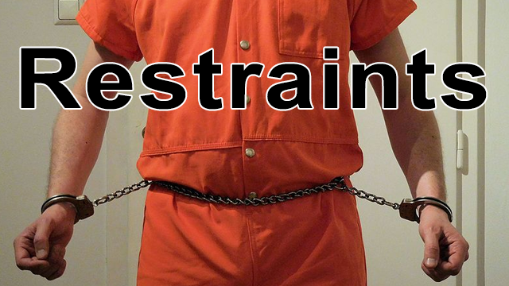

# Another Restraints mod for Rimworld

Based on https://github.com/bdew-rw/Restraints

This mod is free software: you can redistribute it and/or modify it under the terms of the [GNU Lesser General Public License](http://www.gnu.org/licenses/lgpl-3.0.en.html) as published by the Free Software Foundation, either version 3 of the License, or (at your option) any later version.

This Version has some changes compared to the original:
1. using restraints will always work (no berserk)
2. prisoners and slaves can be restrained as well
3. certain pawns might actually like to be restrained :)
